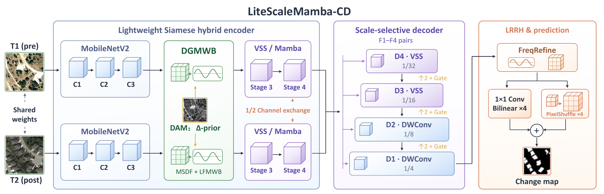

# LiteScaleMamba-CD

Anonymous implementation of binary remote sensing change detection on LEVIR-CD, SYSU-CD and WHU-CD.



## Repository layout

```text
models/             Hybrid_backbone.py, Hybrid_decoder.py, ChangeHybridBCD.py,
                    vmamba.py and csm_triton.py
datasets/           Dataset loader and paired-image augmentation
configs/hybrid.yaml Model settings
figures/            PDF figures and PNG previews
weights/            Best dataset checkpoints (add the supplied .pth files)
train.py            Training and validation
test.py             Evaluation of one selected checkpoint
requirements.txt    Python dependencies
```

The two VMamba support files in `models/` and the selective-scan CUDA extension are required by the three hybrid model files.

## Environment

Use Python 3.10 on Linux with an NVIDIA GPU and a CUDA toolkit of at least 11.6. The following example uses the CUDA 12.1 build of PyTorch 2.2.2; use the [matching PyTorch build](https://docs.pytorch.org/get-started/previous-versions/) for your CUDA environment.

```bash
conda create -n litescalemamba python=3.10 -y
conda activate litescalemamba
python -m pip install torch==2.2.2 torchvision==0.17.2 --index-url https://download.pytorch.org/whl/cu121
python -m pip install -r requirements.txt
python -m pip install --no-build-isolation "selective_scan @ git+https://github.com/ChenHongruixuan/ChangeMamba.git@b834b2a69efd849c43dd99eaa8edc57efbcec1c4#subdirectory=kernels/selective_scan"
python -c "import selective_scan_cuda_oflex"
```

The last installation builds the CUDA selective-scan extension used by the model. It needs a local CUDA compiler (`nvcc`) and cannot be replaced by the ordinary packages in `requirements.txt`. The training runs reported in the paper initialized MobileNetV2 and the VSS stages from ImageNet-pretrained checkpoints; give their paths to `train.py` using `--mobilenet-pretrained` and `--vssm-pretrained`.

## Dataset preparation

Download [LEVIR-CD](https://justchenhao.github.io/LEVIR/), [SYSU-CD](https://github.com/liumency/SYSU-CD) and [WHU-CD](https://gpcv.whu.edu.cn/data/building_dataset.html). For each dataset, arrange its 256 × 256 images and split lists like this:

```text
LEVIR-CD/  (use the same layout for SYSU-CD/ and WHU-CD/)
├── Train
│   ├── A/       *.png
│   ├── B/       *.png
│   ├── label/   *.png
│   └── list/    train.txt
├── Val
│   ├── A/       *.png
│   ├── B/       *.png
│   ├── label/   *.png
│   └── list/    val.txt
└── Test
    ├── A/       *.png
    ├── B/       *.png
    ├── label/   *.png
    └── list/    test.txt
```

Each UTF-8 list contains one image filename per line, with matching names under `A/`, `B/` and `label/` in that split. The list files are provided with or prepared from the datasets; they are not bundled here. `A/` and `B/` images are RGB, and the loader accepts binary labels encoded as either 0/1 or 0/255. The paper uses the following train/validation/test patch counts:

| Dataset | Train | Val | Test |
| --- | ---: | ---: | ---: |
| LEVIR-CD | 7,120 | 1,024 | 2,048 |
| SYSU-CD | 12,000 | 4,000 | 4,000 |
| WHU-CD | 5,947 | 743 | 744 |

The exact filename lists are needed for split-level reproducibility; these counts alone do not determine the original split.

## Training

This example uses LEVIR-CD. Substitute the dataset name and paths for SYSU-CD or WHU-CD.

```bash
python train.py \
  --dataset LEVIR-CD \
  --train-dir /path/to/LEVIR-CD/Train --train-list /path/to/LEVIR-CD/Train/list/train.txt \
  --val-dir /path/to/LEVIR-CD/Val --val-list /path/to/LEVIR-CD/Val/list/val.txt \
  --mobilenet-pretrained /path/to/mobilenet_v2.pth \
  --vssm-pretrained /path/to/vssm_tiny.pth \
  --seed 42
```

The defaults are 150 epochs, batch size 16, AdamW, learning rate 1e-4 and weight decay 5e-4. Validation F1 selects `checkpoints/LEVIR-CD/seed_42/best.pth`. Use the original initialization weights and experiment settings to reproduce training results.

## Best checkpoints and testing

Place these supplied files in `weights/` with their existing names:

```text
weights/LEVIR-CD92.11F1.pth
weights/SYSU-CD84.07F1.pth
weights/WHU-CD94.36F1.pth
```

`test.py` selects the matching supplied checkpoint from `weights/` for `--dataset`. It computes F1, IoU, precision, recall, overall accuracy and Kappa from the model's main prediction over all valid test pixels. The printed values are calculated from the checkpoint and the provided test split; no metric is read from the checkpoint filename or substituted from the paper. A different checkpoint can be evaluated with `--checkpoint /path/to/file.pth`.

```bash
python test.py \
  --dataset LEVIR-CD \
  --test-dir /path/to/LEVIR-CD/Test \
  --test-list /path/to/LEVIR-CD/Test/list/test.txt
```

## Figures and manuscript results

The supplied PDF and PNG figures are [overview](figures/overview.pdf), [difference-guided wavelet bridge](figures/wavelet_bridge.pdf), [refinement head](figures/refinement.pdf) and [LEVIR-CD error maps](figures/levir_error_maps.pdf).

The paper reports three-run means ± standard deviations, which differ from individual best checkpoint results:

| Dataset | F1 (%) | IoU (%) |
| --- | ---: | ---: |
| LEVIR-CD | 91.91 ± 0.08 | 85.03 ± 0.23 |
| WHU-CD | 94.13 ± 0.22 | 89.07 ± 0.19 |
| SYSU-CD | 83.57 ± 0.28 | 71.70 ± 0.42 |

## License and credits

The MambaCD/ChangeMamba-derived code uses Apache-2.0. The included VMamba and Lovasz-Softmax portions retain their MIT permission notices in [THIRD_PARTY.md](THIRD_PARTY.md).
